---
## Front matter
title: "Отчёт по лабораторной работе №3"
subtitle: "Дисциплина: архитектура компьютера."
author: "Наговицын Арсений Владимирович"

## Generic otions
lang: ru-RU
toc-title: "Содержание"

## Bibliography
bibliography: bib/cite.bib
csl: pandoc/csl/gost-r-7-0-5-2008-numeric.csl

## Pdf output format
toc: true # Table of contents
toc-depth: 2
lof: true # List of figures
lot: true # List of tables
fontsize: 12pt
linestretch: 1.5
papersize: a4
documentclass: scrreprt
## I18n polyglossia
polyglossia-lang:
  name: russian
  options:
	- spelling=modern
	- babelshorthands=true
polyglossia-otherlangs:
  name: english
## I18n babel
babel-lang: russian
babel-otherlangs: english
## Fonts
mainfont: PT Serif
romanfont: PT Serif
sansfont: PT Sans
monofont: PT Mono
mainfontoptions: Ligatures=TeX
romanfontoptions: Ligatures=TeX
sansfontoptions: Ligatures=TeX,Scale=MatchLowercase
monofontoptions: Scale=MatchLowercase,Scale=0.9
## Biblatex
biblatex: true
biblio-style: "gost-numeric"
biblatexoptions:
  - parentracker=true
  - backend=biber
  - hyperref=auto
  - language=auto
  - autolang=other*
  - citestyle=gost-numeric
## Pandoc-crossref LaTeX customization
figureTitle: "Рис."
tableTitle: "Таблица"
listingTitle: "Листинг"
lofTitle: "Список иллюстраций"
lotTitle: "Список таблиц"
lolTitle: "Листинги"
## Misc options
indent: true
header-includes:
  - \usepackage{indentfirst}
  - \usepackage{float} # keep figures where there are in the text
  - \floatplacement{figure}{H} # keep figures where there are in the text
---

# Цель работы

Целью работы является освоение процедуры оформления отчетов с помощью легковесного
языка разметки Markdown.

# Задание

1. Установление ПО
2. Заполнение отчета по выполнению лабораторной работы №4 с помощью языка Markdown.
3. Задания для самопроверки.

# Теоретическое введение

Markdown - это простой и интуитивно понятный язык разметки, который позволяет добавлять форматирование к простому тексту. Он был создан с целью облегчить процесс написания и чтения текстов, а также обеспечить возможность преобразования этих текстов в другие форматы.

Одной из основных особенностей Markdown является его простота. Синтаксис Markdown состоит из нескольких простых символов, которые добавляют форматирование к тексту. Например, использование символа решетки (#) перед фразой создает заголовок, использование символов звездочки (*) или подчеркивания (_) добавляет выделение текста жирным или курсивом соответственно.

Еще одной важной особенностью Markdown является его универсальность и переносимость. Поскольку документы Markdown - это обычные текстовые файлы, они могут быть открыты и редактированы в любом текстовом редакторе на любой платформе. Кроме того, они могут быть легко конвертированы во многие другие форматы, такие как PDF, DOC, ODT, HTML и др., с помощью специальных инструментов или онлайн-конвертеров.

# Выполнение лабораторной работы

## Установление ПО

### Установление TexLive

Скачиваю TexLive. Версию от 12.02.2023 (рис. @fig:001).

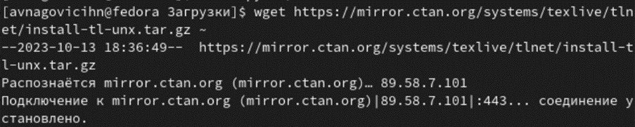{#fig:001 width=70%}

Распаковываю архив (рис. @fig:002).

{#fig:002 width=70%}

Перейдя в папку, запускаю скрипт Install-tl-* с правами root (рис. @fig:003).

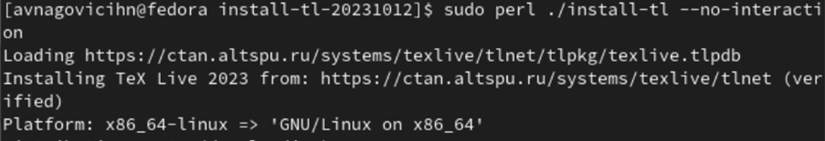{#fig:003 width=70%}

Добавляю /usr/local/texlive/2023/bin/x86_64-Linux в свой PATH (рис. @fig:004).

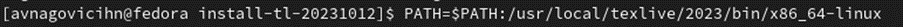{#fig:004 width=70%}

### Установление pandoc и pandoc-crossref

Скачиваю архив pandoc (рис. @fig:005).

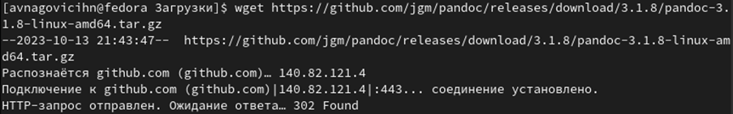{#fig:005 width=70%}

Скачиваю архив pandoc-crossref (рис. @fig:006).

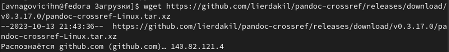{#fig:006 width=70%}

Распаковываю скачанные архивы (рис. @fig:007).

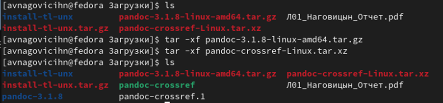{#fig:007 width=70%}

Копирую файлы pandoc и pandoc-crossref в каталог /usr/local/bin/ (рис. @fig:008).

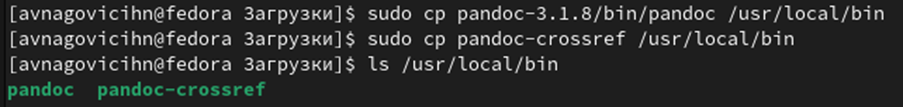{#fig:008 width=70%}

## Заполнение отчета по выполнению лабороторной работы №4 с помощью языка Markdown

Перехожу в каталог курса и обновляю локальный репозиторий (рис. @fig:09).

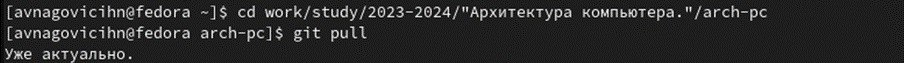{#fig:09 width=70%}

Перейдя в каталог с шаблоном отчета по лабораторной работе №3, компилирую шаблон (рис. @fig:010).

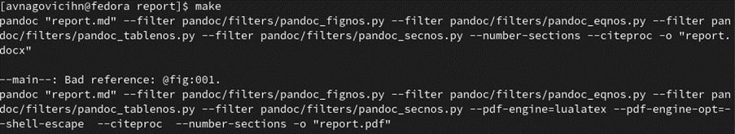{#fig:010 width=70%}

Проверяю корректность выполненных действий (рис. @fig:011).

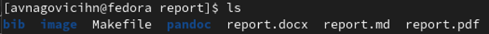{#fig:011 width=70%}

Открываю сгенерированный файл report.docx (рис. @fig:012).

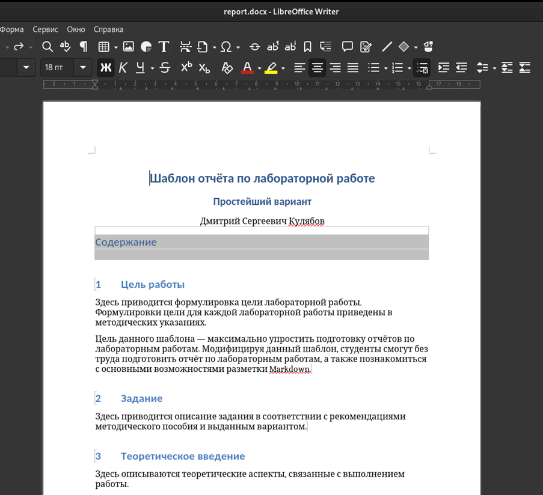{#fig:012 width=70%}

Открываю сгенерированный файл report.pdf (рис. @fig:013).

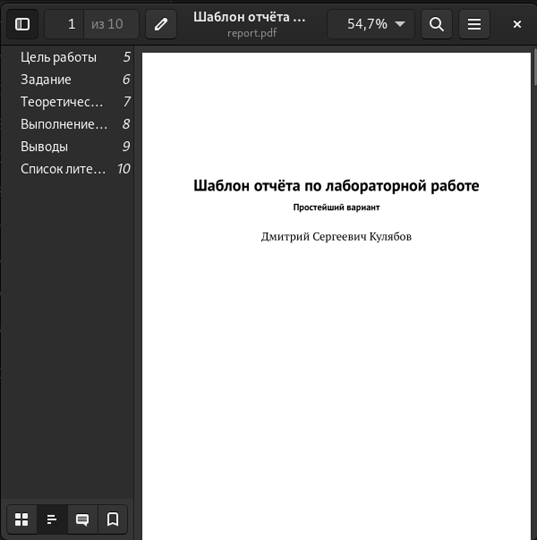{#fig:013 width=70%}

Удаляю полученные файлы с помощью команды make clean (рис. @fig:014).

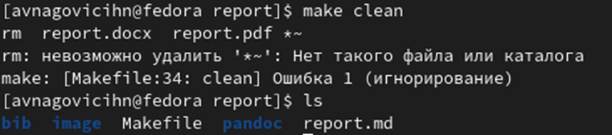{#fig:014 width=70%}

Переименовываю файл report.md в Л03_Наговицын_Отчет.md (рис. @fig:015).

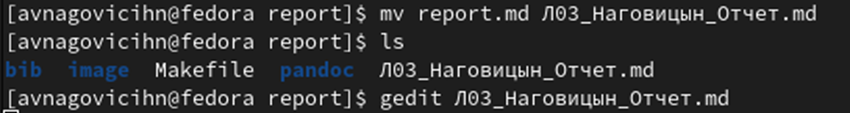{#fig:015 width=70%}

Начинаю заполнять отчет. (рис. @fig:016).

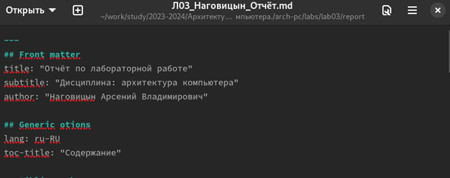{#fig:016 width=70%}

## Задания для самостоятельной работы

1. Перехожу в нужную мне директорию lab02/report (рис. @fig:017).

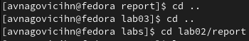{#fig:017 width=70%}

Переименовываю файл report.md в Л02_Наговицын_Отчет.md (рис. @fig:018).

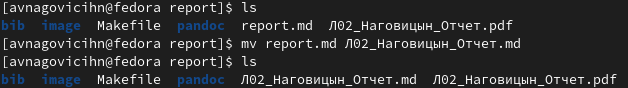{#fig:018 width=70%}

Открываю файл и начинаю и заполнять отчет (рис. @fig:019).

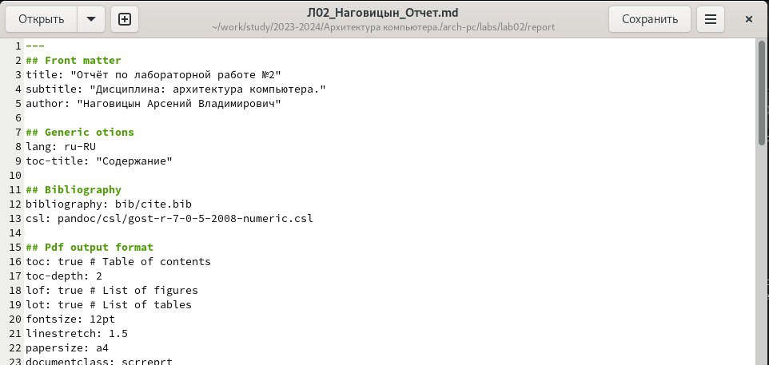{#fig:019 width=70%}

Удаляю предыдущий файл (рис. @fig:021).

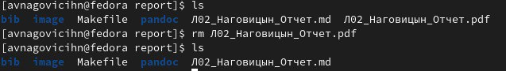{#fig:020 width=70%}

Компилирую файл с отчетом (рис. @fig:022).

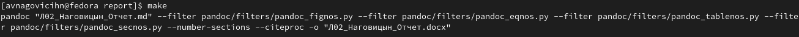{#fig:020 width=70%}

Проверяю корректность выполнения команды (рис. @fig:023).

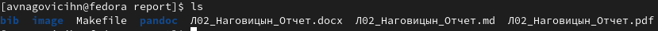{#fig:021 width=70%}

# Выводы

Здесь кратко описываются итоги проделанной работы.

