---
## Front matter
title: "Отчёт по лабораторной работе №4"
subtitle: "Дисциплина: Архитектура компьютера"
author: "Наговицын Арсений Владимирович"

## Generic otions
lang: ru-RU
toc-title: "Содержание"

## Bibliography
bibliography: bib/cite.bib
csl: pandoc/csl/gost-r-7-0-5-2008-numeric.csl

## Pdf output format
toc: true # Table of contents
toc-depth: 2
lof: true # List of figures
lot: true # List of tables
fontsize: 12pt
linestretch: 1.5
papersize: a4
documentclass: scrreprt
## I18n polyglossia
polyglossia-lang:
  name: russian
  options:
	- spelling=modern
	- babelshorthands=true
polyglossia-otherlangs:
  name: english
## I18n babel
babel-lang: russian
babel-otherlangs: english
## Fonts
mainfont: PT Serif
romanfont: PT Serif
sansfont: PT Sans
monofont: PT Mono
mainfontoptions: Ligatures=TeX
romanfontoptions: Ligatures=TeX
sansfontoptions: Ligatures=TeX,Scale=MatchLowercase
monofontoptions: Scale=MatchLowercase,Scale=0.9
## Biblatex
biblatex: true
biblio-style: "gost-numeric"
biblatexoptions:
  - parentracker=true
  - backend=biber
  - hyperref=auto
  - language=auto
  - autolang=other*
  - citestyle=gost-numeric
## Pandoc-crossref LaTeX customization
figureTitle: "Рис."
tableTitle: "Таблица"
listingTitle: "Листинг"
lofTitle: "Список иллюстраций"
lotTitle: "Список таблиц"
lolTitle: "Листинги"
## Misc options
indent: true
header-includes:
  - \usepackage{indentfirst}
  - \usepackage{float} # keep figures where there are in the text
  - \floatplacement{figure}{H} # keep figures where there are in the text
---

# Цель работы

Цель данной работы: освоение процедуры компиляции и сборки программ, написанных на ассемблере NASM.

# Задание

1. Программа Hello world!
2. Работа с транслятором NASM.
3. Работа с расширенным синтаксисом командной строки NASM.
4. Работа с компоновщиком LD.
5. Запуск исполняемого файла.
6. Задание для самостоятельной работы.

# Теоретическое введение

Основными функциональными элементами любой ЭВМ являются центральный процессор, память и периферийные устройства. Эти устройства взаимодействуют друг с другом через общую шину, которая соединяет их. В современных компьютерах проводники шины представлены в виде электропроводящих дорожек на материнской плате.
Центральный процессор выполняет обработку информации и координирует работу всех узлов компьютера. Он состоит из нескольких устройств, включая арифметико-логическое устройство (АЛУ), которое выполняет логические и арифметические операции над данными, и устройство управления (УУ), которое обеспечивает управление и контроль всех устройств компьютера. Также в состав процессора входят регистры - сверхбыстрая оперативная память небольшого объема, используемая для хранения промежуточных результатов выполнения инструкций.

Для написания программ на ассемблере необходимо знать, какие регистры процессора существуют и как их использовать. Примерами основных регистров общего назначения в архитектуре x86 являются RAX, RCX, RDX, RBX, RSI, RDI (64-битные), EAX, ECX, EDX, EBX, ESI, EDI (32-битные), AX, CX, DX, BX, SI, DI (16-битные) и AH, AL, CH, CL, DH, DL, BH, BL (8-битные).
Оперативное запоминающее устройство (ОЗУ) является важным элементом ЭВМ. Оно предназначено для хранения программ и данных, с которыми процессор работает в текущий момент. ОЗУ состоит из ячеек памяти с уникальными номерами, которые служат адресами для хранящихся данных.

Периферийные устройства включают устройства внешней памяти, предназначенные для хранения больших объемов данных, и устройства ввода-вывода, которые обеспечивают взаимодействие с внешней средой.

Вычислительный процесс ЭВМ основан на программном управлении, где задача решается последовательностью действий, записанных в программе. Коды команд представляют собой двоичные комбинации, где операционная часть содержит код выполняемой команды, а адресная часть содержит данные или адреса данных, необходимых для выполнения операции. При выполнении команды процессор выполняет командный цикл, который включает формирование адреса команды, считывание кода команды, выполнение команды и переход к следующей команде.

Язык ассемблера (assembly language) является машинно-ориентированным языком низкого уровня. NASM (Netwide Assembler) - это проект ассемблера, который поддерживает Intel-синтаксис и инструкции x86-64. NASM доступен для различных операционных систем и позволяет получать объектные файлы для этих систем.

# Выполнение лабораторной работы
## Программа Hello world!

Перехожу в каталог, с помощью утилиты cd, и создаю папку lab04 (рис. @fig:001).

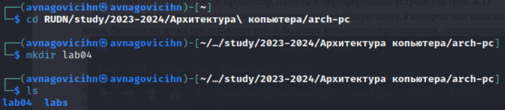{#fig:001 width=70%}

Создаю в текущем каталоге файл и открываю файл в текстовом редакторе (рис. @fig:002).

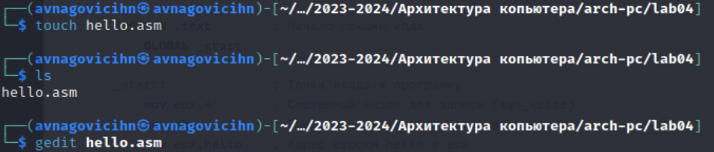{#fig:002 width=70%}

Заполняю файл, вставляя в него программу для вывода "Hello world!" (рис. @fig:003).

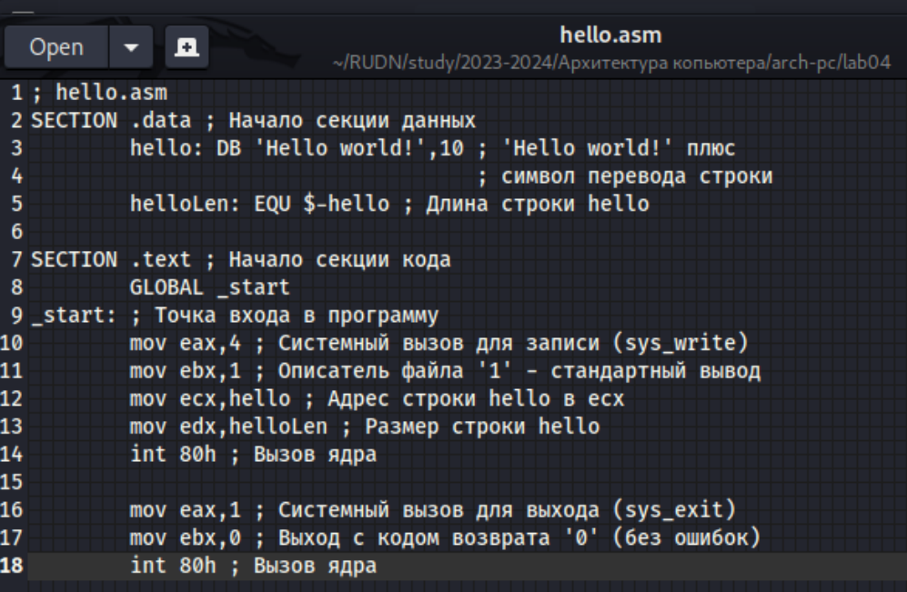{#fig:003 width=70%}

## Работа с транслятором NASM.

Превращаю текст программы в объектный код с помощью транслятора NASM (рис. @fig:004).

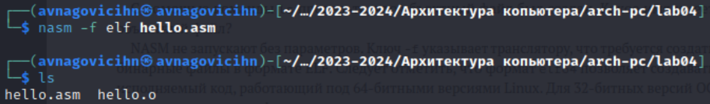{#fig:004 width=70%}

## Работа с расширенным синтаксисом командной строки NASM.

Ввожу команду, которая скомпилирует файл Hello.asm в файл obj.o (рис. @fig:005).

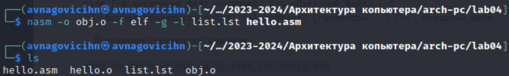{#fig:005 width=70%}

## Работа с компоновщиком LD.

Передаю объектный файл hello.o на обработку компоновщику ld (рис. @fig:006).

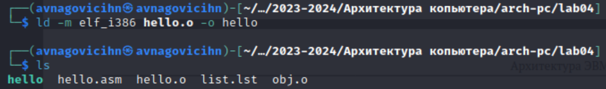{#fig:006 width=70%}

## Запуск исполняемого файла.

Запускаю на выполнение созданный исполняемый файл hello (рис. @fig:007).

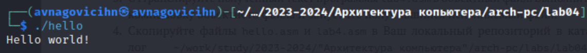{#fig:007 width=70%}

## Задание для самостоятельной работы.

Создаю в текущем каталоге копию файла hello.asm с именем lab4.asm и запускаю в текстовом редакторе (рис. @fig:008).

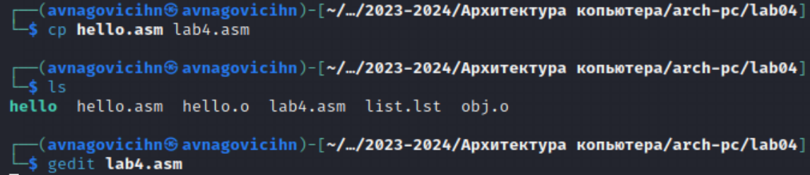{#fig:008 width=70%}

Вношу изменения в программу, чтобы она выводила мое имя и фамилию (рис. @fig:009).

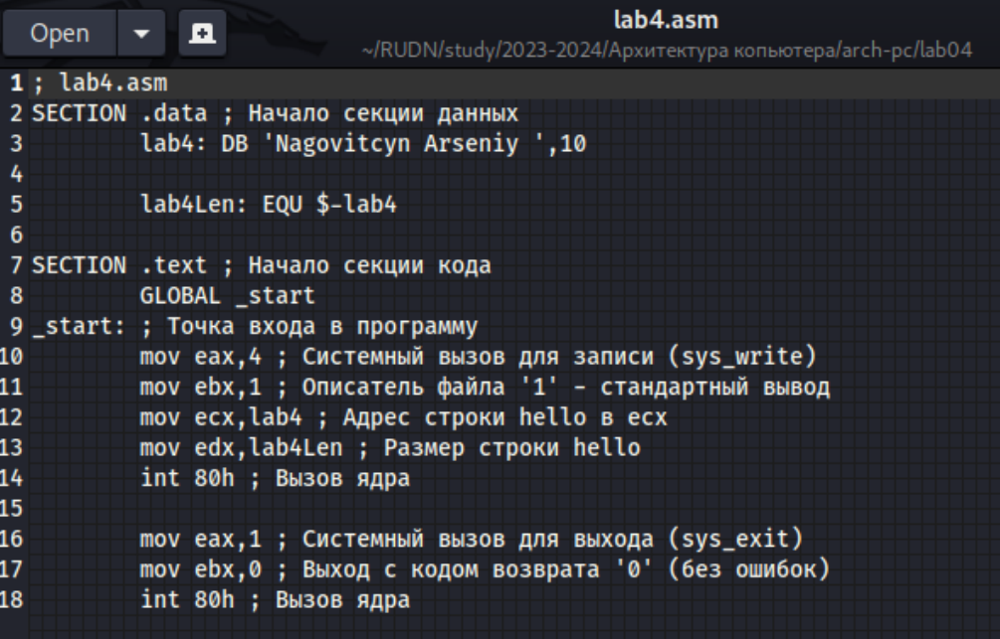{#fig:009 width=70%}

Компилирую текст программы в объектный код с помощью транслятора NASM (рис. @fig:010).

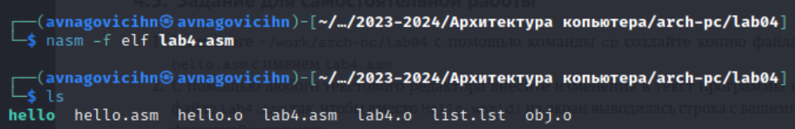{#fig:010 width=70%}

Ввожу команду, которая скомпилирует файл lab4.asm в файл lab4.o (рис. @fig:011).

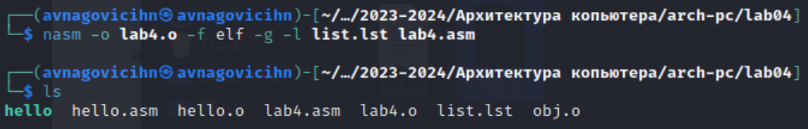{#fig:011 width=70%}

Передаю объектный файл lab4.o на обработку компоновщику LD (рис. @fig:012).

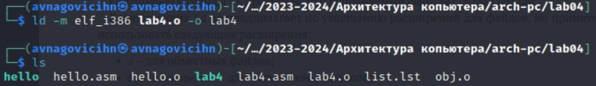{#fig:012 width=70%}

Запускаю на выполнение созданный исполняемый файл lab4 (рис. @fig:013).

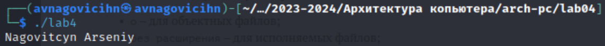{#fig:013 width=70%}

Копирую файлы hello.asm и lab4.asm в каталог (рис. @fig:014).

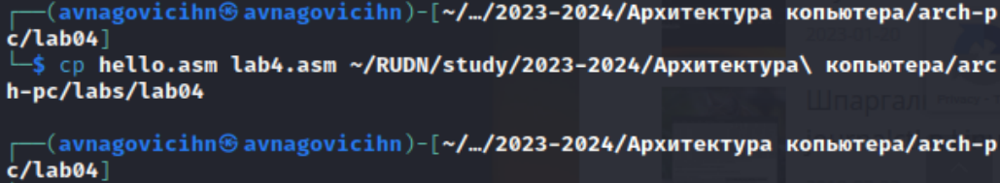{#fig:014 width=70%}

Проверяю нахождение файлов в каталоге (рис. @fig:015).

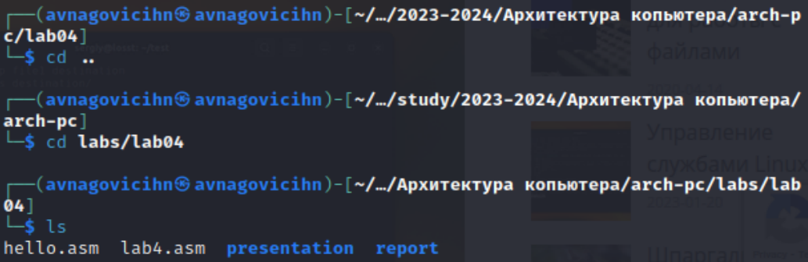{#fig:015 width=70%}

# Выводы

При выполнении данной лабораторной работы я освоил процедуры компиляции и сборки программ, написанных на ассемблере NASM.

