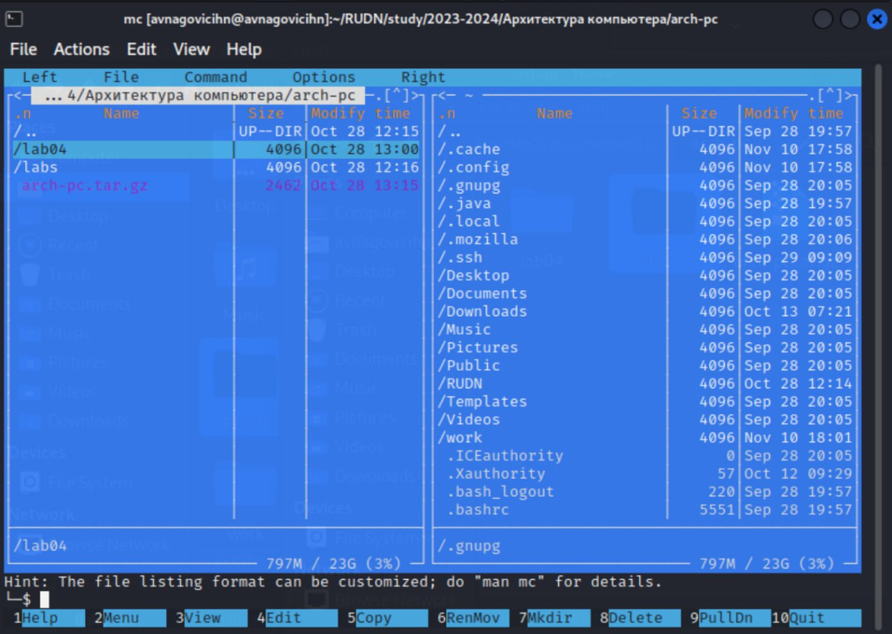

---
## Front matter
title: "Отчёт по лабораторной работе №5"
subtitle: "Дисциплина: архитектура компьютера."
author: "Наговицын Арсений Владимирович"

## Generic otions
lang: ru-RU
toc-title: "Содержание"

## Bibliography
bibliography: bib/cite.bib
csl: pandoc/csl/gost-r-7-0-5-2008-numeric.csl

## Pdf output format
toc: true # Table of contents
toc-depth: 2
lof: true # List of figures
lot: true # List of tables
fontsize: 12pt
linestretch: 1.5
papersize: a4
documentclass: scrreprt
## I18n polyglossia
polyglossia-lang:
  name: russian
  options:
	- spelling=modern
	- babelshorthands=true
polyglossia-otherlangs:
  name: english
## I18n babel
babel-lang: russian
babel-otherlangs: english
## Fonts
mainfont: PT Serif
romanfont: PT Serif
sansfont: PT Sans
monofont: PT Mono
mainfontoptions: Ligatures=TeX
romanfontoptions: Ligatures=TeX
sansfontoptions: Ligatures=TeX,Scale=MatchLowercase
monofontoptions: Scale=MatchLowercase,Scale=0.9
## Biblatex
biblatex: true
biblio-style: "gost-numeric"
biblatexoptions:
  - parentracker=true
  - backend=biber
  - hyperref=auto
  - language=auto
  - autolang=other*
  - citestyle=gost-numeric
## Pandoc-crossref LaTeX customization
figureTitle: "Рис."
tableTitle: "Таблица"
listingTitle: "Листинг"
lofTitle: "Список иллюстраций"
lotTitle: "Список таблиц"
lolTitle: "Листинги"
## Misc options
indent: true
header-includes:
  - \usepackage{indentfirst}
  - \usepackage{float} # keep figures where there are in the text
  - \floatplacement{figure}{H} # keep figures where there are in the text
---

# Цель работы

Целью данной лабораторной работы является приобретение практических
навыков работы в Midnight Commander, освоение инструкций языка ассемблера
mov и int.

# Задание

1. Основы работы с mc
2. Структура программы на языке ассемблера NASM
3. Подключение внешнего файла
4. Выполнение заданий для самостоятельной работы

# Теоретическое введение

Midnight Commander (или просто mc) — это программа, которая позволяет
просматривать структуру каталогов и выполнять основные операции по управлению файловой системой, т.е. mc является файловым менеджером. Midnight
Commander позволяет сделать работу с файлами более удобной и наглядной. Программа на языке ассемблера NASM, как правило, состоит из трёх секций: секция
кода программы (SECTION .text), секция инициированных (известных во время
компиляции) данных (SECTION .data) и секция неинициализированных данных
(тех, под которые во время компиляции только отводится память, а значение
присваивается в ходе выполнения программы) (SECTION .bss). Для объявления
инициированных данных в секции .data используются директивы DB, DW, DD,
DQ и DT, которые резервируют память и указывают, какие значения должны
храниться в этой памяти: - DB (define byte) — определяет переменную размером в 1 байт; - DW (define word) — определяет переменную размеров в 2 байта
(слово); - DD (define double word) — определяет переменную размером в 4 байта
(двойное слово); - DQ (define quad word) — определяет переменную размером в
8 байт (учетве- рённое слово); - DT (define ten bytes) — определяет переменную
размером в 10 байт. Директивы используются для объявления простых переменных и для объявления массивов. Для определения строк принято использовать
директиву DB в связи с особенностями хранения данных в оперативной памяти.
Инструкция языка ассемблера mov предназначена для дублирования данных
источника в приёмнике.

# Выполнение лабораторной работы
## Основы работы с mc

Открываю Midnight Commander, при помощи команды mc (рис. @fig:001).

{ #fig:001 width=70% }

Перехожу в каталог ~/work/study/2022-2023/Архитектура Компьютера/arch-pc рис. @fig:001).

{ #fig:002 width=70% }

Перехожу в каталог ~/work/study/2022-2023/Архитектура Компьютера/arch-pc рис. @fig:001).

{ #fig:002 width=70% }

С помощью функциональной клавиши F7 создаю каталог lab05 (рис. @fig:003).

{ #fig:003 width=70% }

Перехожу в созданный каталог (рис. @fig:004).

{ #fig:004 width=70% }

В строке ввода прописываю команду touch lab5-1.asm, чтобы создать файл, в котором буду работать (рис. @fig:005).

{ #fig:005 width=70% }

Проверяю создался ли файл (рис. @fig:006).

{ #fig:006 width=70% }

## Структура программы на языке ассемблера NASM

С помощью функциональной клавиши F4 открываю созданный файл (рис. @fig:007).

{ #fig:007 width=70% }

Ввожу в файл код программы для запроса строки у пользователя  (рис. @fig:008).

{ #fig:008 width=70% }

С помощью функциональной клавиши F3 открываю файл для просмотра, чтобы проверить, содержит ли файл текст программы (рис. @fig:009).

{ #fig:009 width=70% }

Транслирую текст программы файла в объектный файл (рис. @fig:010).

{ #fig:010 width=70% }

Проверяю правильность выполнения команды (рис. @fig:011).

{ #fig:011 width=70% }

Выполняю компоновку объектного файла (рис. @fig:012).

{ #fig:012 width=70% }

Проверяю правильность выполнения команды (рис. @fig:013).

{ #fig:013 width=70% }

Запускаю исполняемый файл. Программа выводит строку “Введите строку:” и ждет ввода с клавиатуры, я ввожу свои ФИО, на этом программа заканчивает свою работу (рис. @fig:014).

{ #fig:014 width=70% }

## Подключение внешнего файла

Скачиваю файл in_out.asm со страницы курса (рис. @fig:015).

{ #fig:015 width=70% }

С помощью функциональной клавиши F5 копирую файл in_out.asm(рис. @fig:016).

{ #fig:016 width=70% }

С помощью функциональной клавиши F5 копирую файл lab6-1 в тот же каталог, но с другим именем(рис. @fig:017).

{ #fig:017 width=70% }

Проверяю правильность выполнения команды (рис. @fig:018).

{ #fig:018 width=70% }

Изменяю содержимое файла lab6-2.asm (рис. @fig:019).

{ #fig:019 width=70% }

Транслирую текст программы файла в объектный файл. Выполняю компоновку объектного файла. Запускаю исполняемый файл (рис. @fig:020).

{ #fig:020 width=70% }

Изменяю в файле подпрограмму sprintLF на sprint. Сохраняю изменения и открываю файл для просмотра, чтобы проверить сохранение действий (рис. @fig:021).

{ #fig:021 width=70% }

Снова транслирую файл, выполняю компоновку созданного объектного файла, запускаю новый исполняемый файл (рис. @fig:022).

{ #fig:022 width=70% }

Разница между первым исполняемым файлом  и вторым заключается в том, что запуск первого запрашивает ввод с новой строки, а вторая программа, запрашивает ввод без переноса на новую строку.В этом заключается различие между подпрограммами sprintLF и sprint.

## Выполнение заданий для самостоятельной работы

Создаю копию файла lab5-1.asm с именем lab5-1_1.asm (рис. @fig:023).

{ #fig:023 width=70% }

Открываю созданный файл для редактирования. Изменяю программу так, чтобы кроме вывода приглашения и запроса ввода, она выводила вводимую пользователем строку (рис. @fig:024).

{ #fig:024 width=70% }

Создаю объектный файл, отдаю его на обработку компоновщику, получаю исполняемый файл , запускаю файл (рис. @fig:025).

{ #fig:025 width=70% }

Создаю копию файла lab5-2.asm с именем lab5-2_1.asm (рис. @fig:026).

{ #fig:026 width=70% }

Открываю созданный файл для редактирования. Изменяю программу так, чтобы кроме вывода приглашения и запроса ввода, она выводила вводимую пользователем строку (рис. @fig:027).

{ #fig:027 width=70% }

Создаю объектный файл, отдаю его на обработку компоновщику, получаю исполняемый файл , запускаю файл (рис. @fig:028).

{ #fig:028 width=70% }

# Выводы

При выполнении данной лабораторной работы я приобрел практические навыки работы в Midnight Commander, а также освоил инструкции языка ассемблера mov и int.

