---
## Front matter
title: "Отчёт по лабораторной работе №6"
subtitle: "Дисциплина: Архитектура компьютера"
author: "Наговицын Арсений Владимирович"

## Generic otions
lang: ru-RU
toc-title: "Содержание"

## Bibliography
bibliography: bib/cite.bib
csl: pandoc/csl/gost-r-7-0-5-2008-numeric.csl

## Pdf output format
toc: true # Table of contents
toc-depth: 2
lof: true # List of figures
lot: true # List of tables
fontsize: 12pt
linestretch: 1.5
papersize: a4
documentclass: scrreprt
## I18n polyglossia
polyglossia-lang:
  name: russian
  options:
	- spelling=modern
	- babelshorthands=true
polyglossia-otherlangs:
  name: english
## I18n babel
babel-lang: russian
babel-otherlangs: english
## Fonts
mainfont: PT Serif
romanfont: PT Serif
sansfont: PT Sans
monofont: PT Mono
mainfontoptions: Ligatures=TeX
romanfontoptions: Ligatures=TeX
sansfontoptions: Ligatures=TeX,Scale=MatchLowercase
monofontoptions: Scale=MatchLowercase,Scale=0.9
## Biblatex
biblatex: true
biblio-style: "gost-numeric"
biblatexoptions:
  - parentracker=true
  - backend=biber
  - hyperref=auto
  - language=auto
  - autolang=other*
  - citestyle=gost-numeric
## Pandoc-crossref LaTeX customization
figureTitle: "Рис."
tableTitle: "Таблица"
listingTitle: "Листинг"
lofTitle: "Список иллюстраций"
lotTitle: "Список таблиц"
lolTitle: "Листинги"
## Misc options
indent: true
header-includes:
  - \usepackage{indentfirst}
  - \usepackage{float} # keep figures where there are in the text
  - \floatplacement{figure}{H} # keep figures where there are in the text
---

# Цель работы

Цель данной лабораторный работы - освоение арифметических инструкций языка ассемблера NASM.

# Задание

1. Символьные и численные данные в NASM
2. Выполнение арифметических операций в NASM
3. Выполнение заданий для самостоятельной работы

# Теоретическое введение

Большинство инструкций на языке ассемблера требуют обработки операндов. Адрес операнда предоставляет место, где хранятся данные, подлежащие обработке. Это могут быть данные хранящиеся в регистре или в ячейке памяти. 
- Регистровая адресация – операнды хранятся в регистрах и в команде используются имена этих регистров, например: mov ax,bx.
- Непосредственная адресация – значение операнда задается непосредственно в команде, Например: mov ax,2.
- Адресация памяти – операнд задает адрес в памяти. В команде указывается символическое обозначение ячейки памяти, над содержимым которой требуется выполнить операцию.

Ввод информации с клавиатуры и вывод её на экран осуществляется в символьном виде. Кодирование этой информации производится согласно кодовой таблице символов ASCII. ASCII – сокращение от American Standard Code for Information Interchange (Американский стандартный код для обмена информацией). Согласно стандарту ASCII каждый символ кодируется одним байтом.
Среди инструкций NASM нет такой, которая выводит числа (не в символьном виде). Поэтому, например, чтобы вывести число, надо предварительно преобразовать его цифры в ASCII-коды этих цифр и выводить на экран эти коды, а не само число. Если же выводить число на экран непосредственно, то экран воспримет его не как число, а как последовательность ASCII-символов – каждый байт числа будет воспринят как один ASCII-символ – и выведет на экран эти символы.

# Выполнение лабораторной работы
## Выполнение арифметических операций в NASM

Создаю директорию, в которой буду выполнять лабораторную работу (рис. @fig:001).

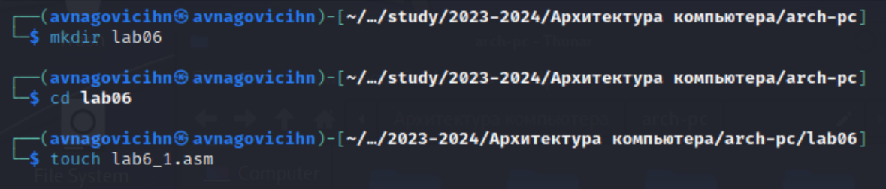{#fig:001 width=70%}

Копирую в каталог файл in_out.asm (рис. @fig:002).

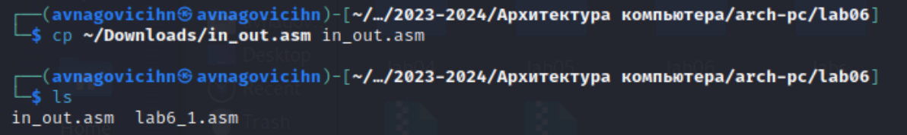{#fig:002 width=70%}

Открываю созданный файл и вставляю в него программу для вывода (рис. @fig:003).

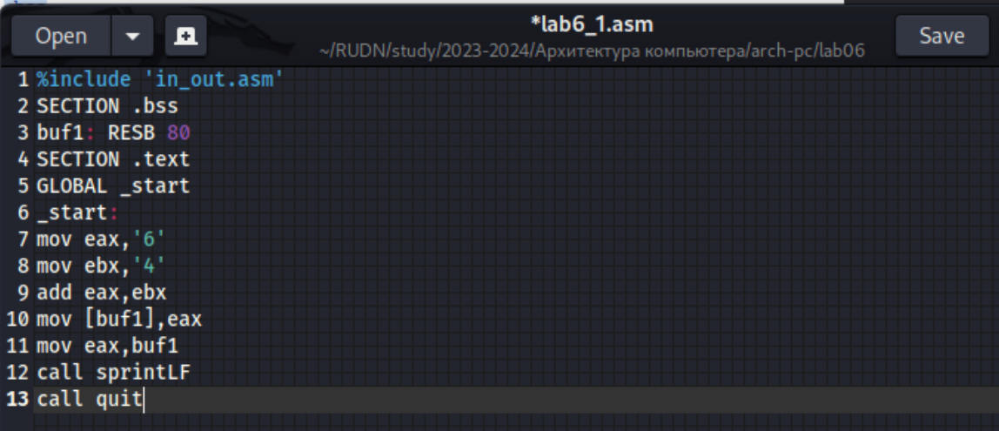{#fig:003 width=70%}

Создаю исполняемый файл и запускаю его (рис. @fig:004).

{#fig:004 width=70%}

Изменяю текст программы (рис. @fig:005).

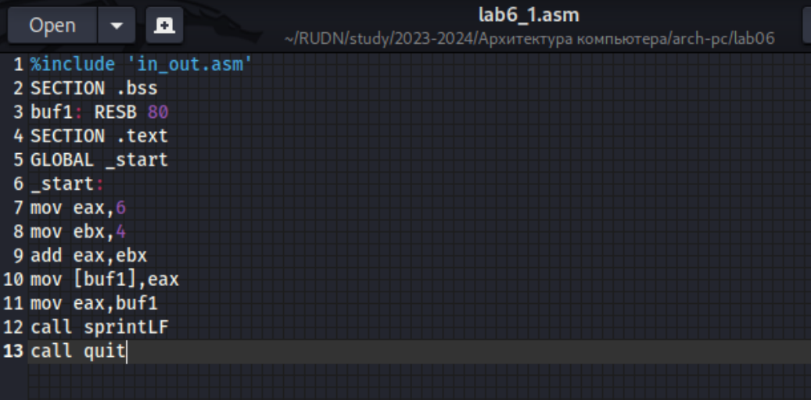{#fig:005 width=70%}

Создаю исполняемый файл и запускаю его (рис. @fig:004).

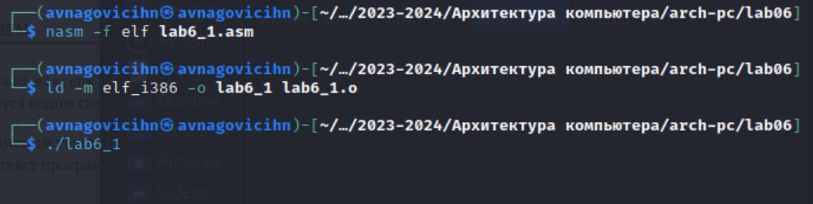{#fig:006 width=70%}

Создав файл, ввожу текст программы (рис. @fig:007).

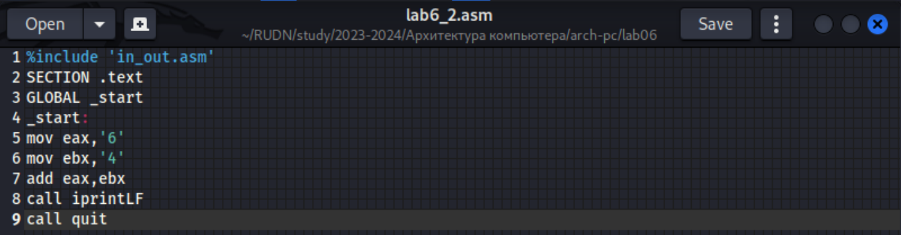{#fig:007 width=70%}

Создаю исполняемый файл и запускаю его (рис. @fig:008). Теперь вывод 10, потому что программа позволяет вывести именно число, а не символ, хотя все еще происходит именно сложение кодов символов "6" и "4".

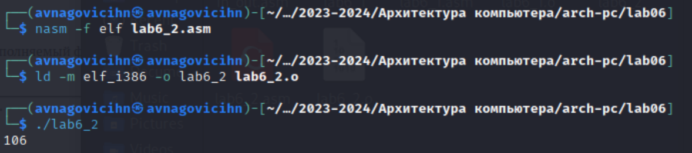{#fig:008 width=70%}

Заменяю в тексте файла символы "6" и "4" на 6 и 4 (рис. @fig:009).

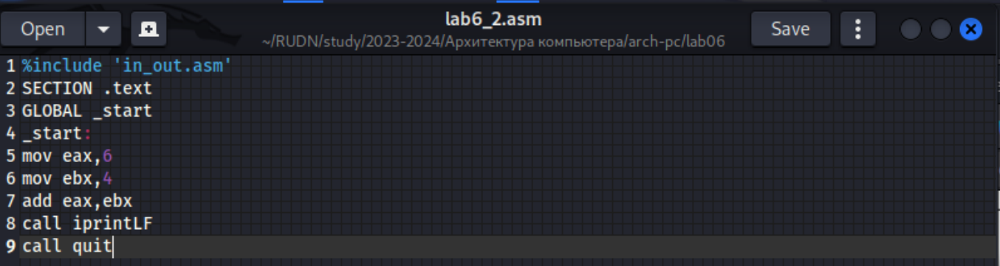{#fig:009 width=70%}

Создаю исполняемый файл и запускаю его (рис. @fig:010). Теперь программа складывает не соответствующие символам коды в системе ASCII, а сами числа, поэтому вывод 10.

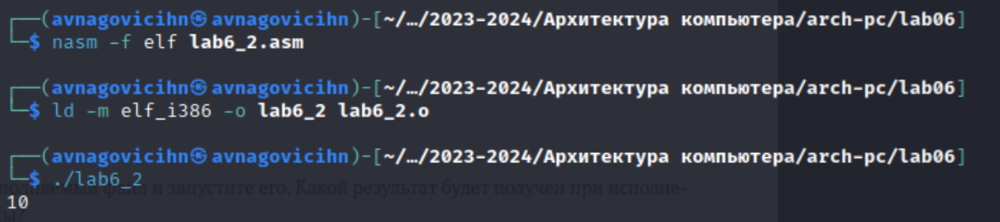{#fig:010 width=70%}

Заменяю в тексте файла функцию iprintLF на iprint (рис. @fig:011).

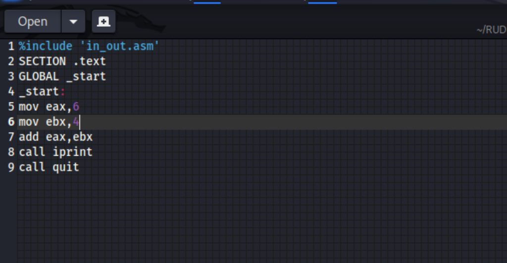{#fig:011 width=70%}

Создаю исполняемый файл и запускаю его (рис. @fig:012). Вывод не изменился, потому что символ переноса строки не отображается, когда программа исполнялась с функцией iprintLF, а iprint не добавляет к выводу символ переноса строки.

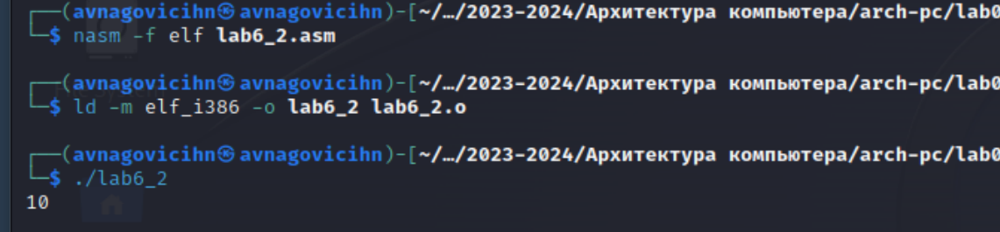{#fig:012 width=70%}

## Выполнение арифметических операций в NASM 

Создаю файл (рис. @fig:013).

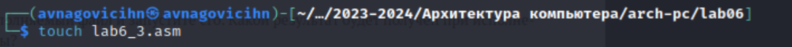{#fig:013 width=70%}

Ввожу текст программы в созданный файл (рис. @fig:014).

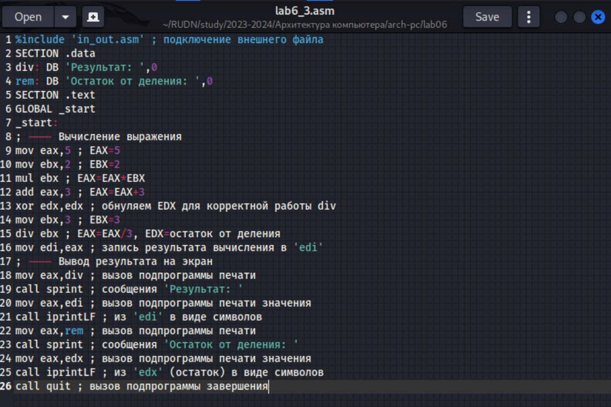{#fig:014 width=70%}

Создаю исполняемый файл и запускаю его (рис. @fig:015).

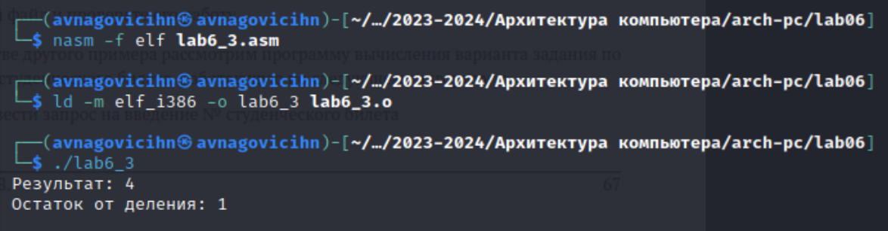{#fig:015 width=70%}

Изменяю программу так, чтобы она вычисляла значение выражения f(x) = (4 * 6 + 2)/5 (рис. @fig:016).

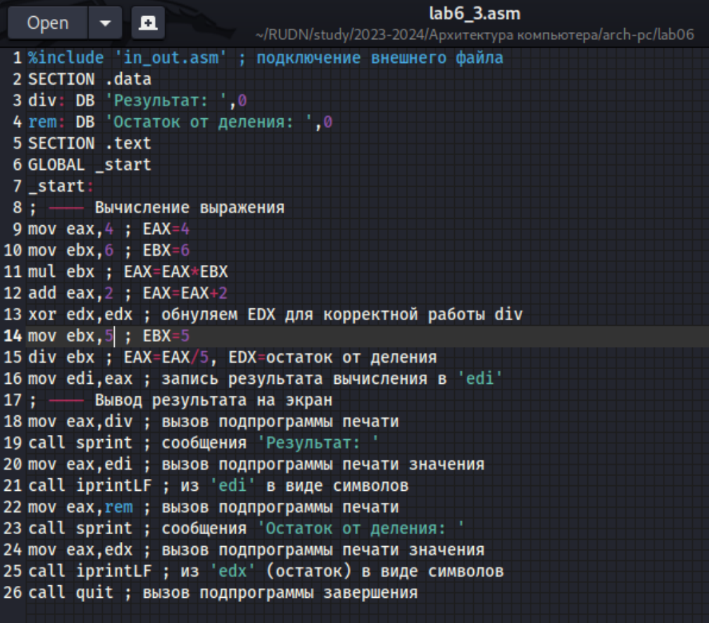{#fig:016 width=70%}

Создаю исполняемый файл и запускаю его (рис. @fig:017).

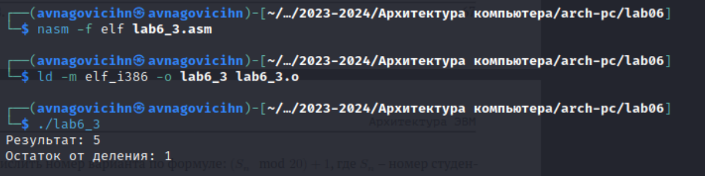{#fig:017 width=70%}

Создаю файл variant.asm (рис. @fig:018).

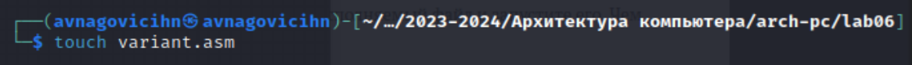{#fig:018 width=70%}

Ввожу текст программы в созданный файл (рис. @fig:019).

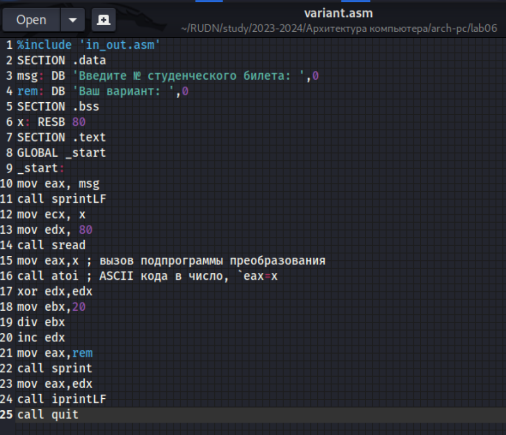{#fig:019 width=70%}

Создаю исполняемый файл и запускаю его (рис. @fig:020).

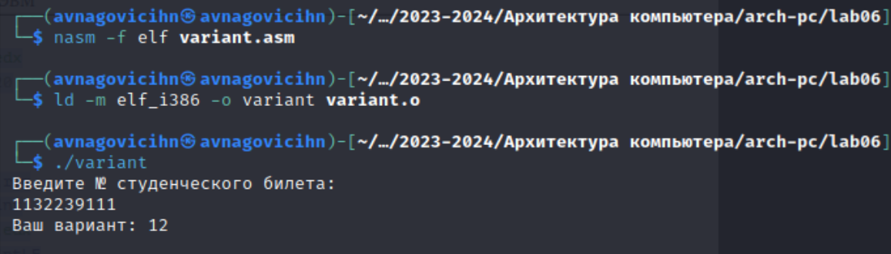{#fig:020 width=70%}

### Ответы на вопросы по программе

1. За вывод сообщения "Ваш вариант" отвечают строки кода:

mov eax,rem
call sprint

2. Инструкция mov ecx, x используется, чтобы положить адрес вводимой строки x в регистр ecx
mov edx, 80 - запись в регистр edx длины вводимой строки 
call sread - вызов подпрограммы из внешнего файла, обеспечивающей ввод сообщения с клавиатуры 

3. call atoi используется для вызова подпрограммы из внешнего файла, которая преобразует ascii-код символа в целое число и записывает результат в регистр eax

4. За вычисления варианта отвечают строки:

xor edx,edx 
mov ebx,2 
div ebx 
inc edx 


5. При выполнении инструкции div ebx остаток от деления записывается в регистр edx

6. inc edx увеличивает значение регистра edx на 1

7. За вывод на экран результатов вычислений отвечают строки:

mov eax,edx
call iprintLF

## Выполнение заданий для самостоятельной работы.

Создаю файл lab6_4.asm (рис. @fig:021).

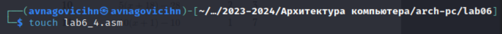{#fig:021 width=70%}

Ввожу текст программы для вычислений выражения f=(8x-6)/2 (рис. @fig:022).

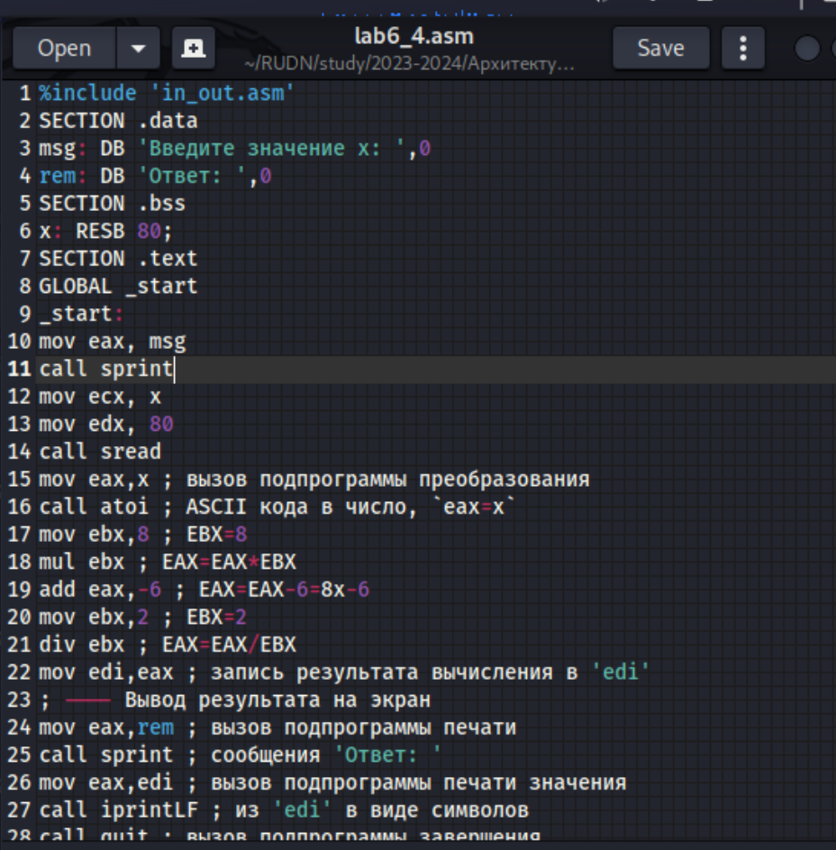{#fig:022 width=70%}

Создаю исполняемый файл и запускаю его (рис. @fig:023).

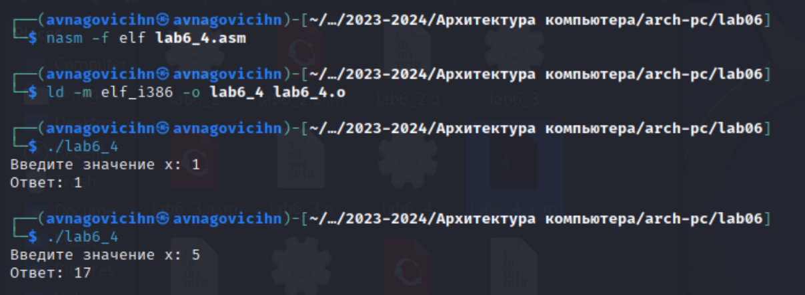{#fig:023 width=70%}

**Листинг 4.1. Программа для вычисления значения выражения (8 x - 6) / 2 .**

```NASM
%include 'in_out.asm'
SECTION .data
msg: DB 'Введите значение x: ',0
rem: DB 'Ответ: ',0
SECTION .bss
x: RESB 80;
SECTION .text
GLOBAL _start
_start:
mov eax, msg
call sprint
mov ecx, x
mov edx, 80
call sread
mov eax,x ; вызов подпрограммы преобразования
call atoi ; ASCII кода в число, `eax=x`
mov ebx,8 ; EBX=8
mul ebx ; EAX=EAX*EBX
add eax,-6 ; EAX=EAX-6=8x-6
mov ebx,2 ; EBX=2
div ebx ; EAX=EAX/EBX
mov edi,eax ; запись результата вычисления в 'edi'
; ---- Вывод результата на экран
mov eax,rem ; вызов подпрограммы печати
call sprint ; сообщения 'Ответ: '
mov eax,edi ; вызов подпрограммы печати значения
call iprintLF ; из 'edi' в виде символов
call quit ; вызов подпрограммы завершения
```
# Выводы

При выполнении данной лабораторной работы я освоил арифметические инструкции языка ассемблера NASM.
