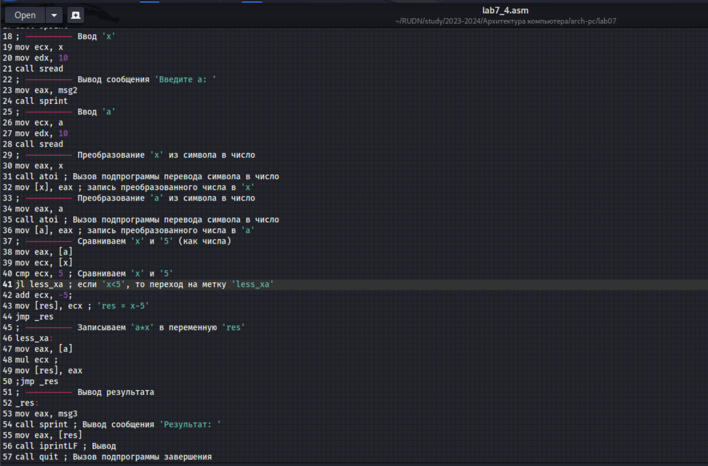

---
## Front matter
title: "Отчёт по лабораторной работе №7"
subtitle: "Дисциплина: архитектура компьютера."
author: "Наговицын Арсений Владимирович"

## Generic otions
lang: ru-RU
toc-title: "Содержание"

## Bibliography
bibliography: bib/cite.bib
csl: pandoc/csl/gost-r-7-0-5-2008-numeric.csl

## Pdf output format
toc: true # Table of contents
toc-depth: 2
lof: true # List of figures
lot: true # List of tables
fontsize: 12pt
linestretch: 1.5
papersize: a4
documentclass: scrreprt
## I18n polyglossia
polyglossia-lang:
  name: russian
  options:
	- spelling=modern
	- babelshorthands=true
polyglossia-otherlangs:
  name: english
## I18n babel
babel-lang: russian
babel-otherlangs: english
## Fonts
mainfont: PT Serif
romanfont: PT Serif
sansfont: PT Sans
monofont: PT Mono
mainfontoptions: Ligatures=TeX
romanfontoptions: Ligatures=TeX
sansfontoptions: Ligatures=TeX,Scale=MatchLowercase
monofontoptions: Scale=MatchLowercase,Scale=0.9
## Biblatex
biblatex: true
biblio-style: "gost-numeric"
biblatexoptions:
  - parentracker=true
  - backend=biber
  - hyperref=auto
  - language=auto
  - autolang=other*
  - citestyle=gost-numeric
## Pandoc-crossref LaTeX customization
figureTitle: "Рис."
tableTitle: "Таблица"
listingTitle: "Листинг"
lofTitle: "Список иллюстраций"
lotTitle: "Список таблиц"
lolTitle: "Листинги"
## Misc options
indent: true
header-includes:
  - \usepackage{indentfirst}
  - \usepackage{float} # keep figures where there are in the text
  - \floatplacement{figure}{H} # keep figures where there are in the text
---

# Цель работы

Целью данной лабораторной работы является изучение команд условного и безусловного переходов, приобретение навыков написания программ с использованием переходов и знакомство с назначением и структурой файла листинга.

# Задание

1. Реализация переходов в NASM
2. Изучение структуры файлы листинга.
3. Выполнение заданий для самостоятельной работы

# Выполнение лабораторной работы
## Реализация переходов в NASM
Создаю каталог для программ и перехожу в него. Создаю файл (рис. @fig:001).

{#fig:001 width=70%}

Ввожу в файл текст программы из листинга 7.1(рис. @fig:002).

{#fig:002 width=70%}

**Листинг 7.1 Программа с использованием инструкции jmp**

```NASM
%include 'in_out.asm' ; подключение внешнего файла
SECTION .data
msg1: DB 'Сообщение № 1',0
msg2: DB 'Сообщение № 2',0
msg3: DB 'Сообщение № 3',0
SECTION .text
GLOBAL _start
_start:
jmp _label2
_label1:
mov eax, msg1 ; Вывод на экран строки
call sprintLF ; 'Сообщение № 1'
_label2:
mov eax, msg2 ; Вывод на экран строки
call sprintLF ; 'Сообщение № 2'
_label3:
mov eax, msg3 ; Вывод на экран строки
call sprintLF ; 'Сообщение № 3'
_end:
call quit ; вызов подпрограммы завершения
```
Создаю исполняемый файл и запускаю его (рис. @fig:003).

{#fig:003 width=70%}

Изменяю текст программы в соответствии с листингом 7.2 (рис. @fig:004)

{#fig:004 width=70%}

Создаю исполняемый файл и запускаю его (рис. @fig:005).

{#fig:005 width=70%}

**Листинг 7.2 Программа с использованием инструкции jmp**
```NASM
%include 'in_out.asm' ; подключение внешнего файла
SECTION .data
msg1: DB 'Сообщение № 1',0
msg2: DB 'Сообщение № 2',0
msg3: DB 'Сообщение № 3',0
SECTION .text
GLOBAL _start
_start:
jmp _label2
_label1:
mov eax, msg1 ; Вывод на экран строки
call sprintLF ; 'Сообщение № 1'
jmp _end
_label2:
mov eax, msg2 ; Вывод на экран строки
call sprintLF ; 'Сообщение № 2'
jmp _label1
_label3:
mov eax, msg3 ; Вывод на экран строки
call sprintLF ; 'Сообщение № 3'
_end:
call quit ; вызов подпрограммы завершения
```

Изменяю текст программы так, чтобы программа сначала выводила 'Сообщение № 3', затем 'Сообщение № 2', а затем 'Сообщение № 1' (рис. @fig:006)

{#fig:006 width=70%}

**Листинг 7.3 Программа с использованием инструкции jmp**
```NASM
%include 'in_out.asm' ; подключение внешнего файла
SECTION .data
msg1: DB 'Сообщение № 1',0
msg2: DB 'Сообщение № 2',0
msg3: DB 'Сообщение № 3',0
SECTION .text
GLOBAL _start
_start:
jmp _label3
_label1:
mov eax, msg1 ; Вывод на экран строки
call sprintLF ; 'Сообщение № 1'
jmp _end
_label2:
mov eax, msg2 ; Вывод на экран строки
call sprintLF ; 'Сообщение № 2'
jmp _label1
_label3:
mov eax, msg3 ; Вывод на экран строки
call sprintLF ; 'Сообщение № 3'
jmp _label2
_end:
call quit ; вызов подпрограммы завершения
```

Создаю исполняемый файл и запускаю его (рис. @fig:007).

{#fig:007 width=70%}

Создаю новый файл lab7_2.asm (рис. @fig:008).

{#fig:008 width=70%}

Изменяю текст программы в соответствии с листингом 7.4 (рис. @fig:009)

{#fig:009 width=70%}

**Листинг 7.4 Программа с использованием инструкции jmp**
```NASM
%include 'in_out.asm'
section .data
msg1 db 'Введите B: ',0h
msg2 db "Наибольшее число: ",0h
A dd '20'
C dd '50'
section .bss
max resb 10
B resb 10
section .text
global _start
_start:
; ---------- Вывод сообщения 'Введите B: '
mov eax,msg1
call sprint
; ---------- Ввод 'B'
mov ecx,B
mov edx,10
call sread
; ---------- Преобразование 'B' из символа в число
mov eax,B
call atoi ; Вызов подпрограммы перевода символа в число
mov [B],eax ; запись преобразованного числа в 'B'
; ---------- Записываем 'A' в переменную 'max'
mov ecx,[A] ; 'ecx = A'
mov [max],ecx ; 'max = A'
; ---------- Сравниваем 'A' и 'С' (как символы)
cmp ecx,[C] ; Сравниваем 'A' и 'С'
jg check_B ; если 'A>C', то переход на метку 'check_B',
mov ecx,[C] ; иначе 'ecx = C'
mov [max],ecx ; 'max = C'
; ---------- Преобразование 'max(A,C)' из символа в число
check_B:
mov eax,max
call atoi ; Вызов подпрограммы перевода символа в число
mov [max],eax ; запись преобразованного числа в max
; ---------- Сравниваем 'max(A,C)' и 'B' (как числа)
mov ecx,[max]
cmp ecx,[B] ; Сравниваем 'max(A,C)' и 'B'
jg fin ; если 'max(A,C)>B', то переход на 'fin',
mov ecx,[B] ; иначе 'ecx = B'
mov [max],ecx
; ---------- Вывод результата
fin:
mov eax, msg2
call sprint ; Вывод сообщения 'Наибольшее число: '
mov eax,[max]
call iprintLF ; Вывод 'max(A,B,C)'
call quit ; Выход
```
Создаю исполняемый файл, запускаю его и проверяю на нескольких значениях (рис. @fig:010).

{#fig:010 width=70%}
 
## Изучение структуры файла листинга

Создаю файл листинга для программы из файла lab7-2.asm (рис. @fig:011).

{#fig:011 width=70%}

Открываю файл листинга (рис. @fig:012).

{#fig:012 width=70%}

**Объясняю содержимое первой выбранной строки:**

```NASM
4 00000000 53                push ebx
```

4 - номер строки; 00000000 - адрес строки (смещение машинного кода от начала текущего сегмента); "53" - машинный код; "push ebx" - исходный текст программы. Инструкция "push" помещает операнд "ebx" в стек.

**Объясняю содержимое второй выбранной строки:**

```NASM
29 00000018 89C2            mov edx,eax
```

29 - номер строки; 00000018 - адрес строки (смещение машинного кода от начала текущего сегмента); "89C2" - машинный код; mov edx,eax - исходный текст программы. Инструкция на машинном языке, записывающая значение переменной eax в регистр edx

**Объясняю содержимое третьей выбранной строки:**

```NASM
20                      Функция печати сообщения
```

20 - номер строки; Функция печати сообщения - комментарий к коду, не имеет адреса, машинного кода.

Открываю файл с программой и удаляю операнд (рис. @fig:013).

{#fig:013 width=70%}

Выполняю трансляцию файла (рис. @fig:014).

{#fig:014 width=70%}

На выходе я не получаю никаких файлов, так как инструкция cmp подразумевает сравнение двух операндов.

## Выполнение заданий для самостоятельной работы

1. Создаю новый файл lab7_3.asm (рис. @fig:015).

{#fig:015 width=70%}

Открываю файл и пишу программу. Присваиваю переменным значения, указанные в 12 варианте (99,29,26) (рис. @fig:016).

{#fig:016 width=70%}

Создаю исполняемый файл и запускаю его (рис. @fig:017).

{#fig:017 width=70%}

**Листинг 7.5. Программа для нахождения наименьшего числа**
```NASM
%include 'in_out.asm'
SECTION .data
msg db "Наименьшее число: ",0h
A dd '99'
B dd '29'
C dd '26'

SECTION .bss
min resb 10

SECTION .text
global _start
_start:
; ---------- Записываем 'A'
mov ecx,[A] ; 'ecx = A'
mov [min],ecx ; 'min = A'
; ---------- Сравниваем 'A' и 'С' (как символы)
cmp ecx,[C] ; Сравниваем 'A' и 'С'
jl check_B ; если 'A<C', то переход на метку 'check_B',
mov ecx,[C] ; иначе 'ecx = C'
mov [min],ecx ; 'min = C'
; ---------- Преобразование 'min(A,C)' из символа в число
check_B:
mov eax,min
call atoi ; Вызов подпрограммы перевода символа в число
mov [min],eax ; запись преобразованного числа в min
; ---------- Сравниваем 'min(A,C)' и 'B' (как числа)
mov ecx,[min]
cmp ecx,[B] ; Сравниваем 'min(A,C)' и 'B'
jl fin ; если 'min(A,C)<B', то переход на 'fin',
mov ecx,[B] ; иначе 'ecx = B'
mov [min],ecx
; ---------- Вывод результата
fin:
mov eax, msg
call sprint ; Вывод сообщения 'Наименьшее число: '
mov eax,[min]
call iprintLF ; Вывод 'min(A,B,C)'
call quit ; Выход
```

2. Создаю новый файл lab7_4.asm (рис. @fig:018).

{#fig:018 width=70%}

Открываю файл и пишу программу (рис. @fig:019).

{#fig:019 width=70%}

Создаю исполняемый файл и запускаю его. Ввожу значения в соответствии со своим вариантом ((3;7),(6;4)) (рис. @fig:020).

{#fig:020 width=70%}

**Листинг 7.6 Программа для вычисления заданной функции**
```NASM
%include 'in_out.asm'
SECTION .data
msg1 db 'Введите x: ', 0h
msg2 db 'Введите a: ', 0h
msg3 db 'Результат: ', 0h

SECTION .bss
x resb 11
a resb 11
res resb 12

SECTION .text
global _start
_start:
; ---------- Вывод сообщения 'Введите x: '
mov eax, msg1
call sprint
; ---------- Ввод 'x'
mov ecx, x
mov edx, 10
call sread
; ---------- Вывод сообщения 'Введите a: '
mov eax, msg2
call sprint
; ---------- Ввод 'a'
mov ecx, a
mov edx, 10
call sread
; ---------- Преобразование 'x' из символа в число
mov eax, x
call atoi ; Вызов подпрограммы перевода символа в число
mov [x], eax ; запись преобразованного числа в 'x'
; ---------- Преобразование 'a' из символа в число
mov eax, a
call atoi ; Вызов подпрограммы перевода символа в число
mov [a], eax ; запись преобразованного числа в 'a'
; ---------- Сравниваем 'x' и '5' (как числа)
mov eax, [a]
mov ecx, [x]
cmp ecx, 5 ; Сравниваем 'x' и '5'
jl less_xa ; если 'x<5', то переход на метку 'less_xa'
add ecx, -5;
mov [res], ecx ; 'res = x-5'
jmp _res
; ---------- Записываем 'a*x' в переменную 'res'
less_xa:
mov eax, [a]
mul ecx ;
mov [res], eax 
;jmp _res
; ---------- Вывод результата
_res:
mov eax, msg3
call sprint ; Вывод сообщения 'Результат: '
mov eax, [res]
call iprintLF ; Вывод
call quit ; Вызов подпрограммы завершения
```

# Выводы

В ходе выполнения данной лабораторной работы я изучил команды условного и безусловного переходов, приобрёл навыки написания программ с использованием переходов и познакомился с назначением и структурой файла листинга.

