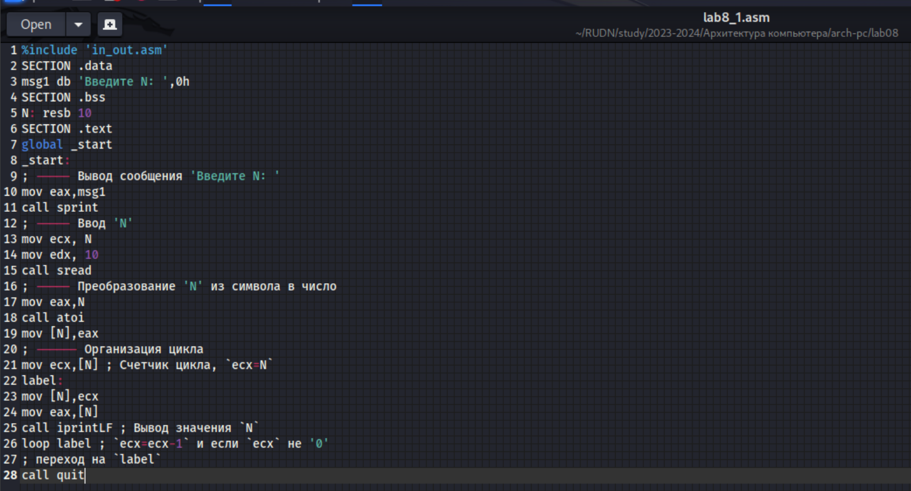

---
## Front matter
title: "Отчёт по лабораторной работе №7"
subtitle: "Дисциплина: архитектура компьютера."
author: "Наговицын Арсений Владимирович"

## Generic otions
lang: ru-RU
toc-title: "Содержание"

## Bibliography
bibliography: bib/cite.bib
csl: pandoc/csl/gost-r-7-0-5-2008-numeric.csl

## Pdf output format
toc: true # Table of contents
toc-depth: 2
lof: true # List of figures
lot: true # List of tables
fontsize: 12pt
linestretch: 1.5
papersize: a4
documentclass: scrreprt
## I18n polyglossia
polyglossia-lang:
  name: russian
  options:
	- spelling=modern
	- babelshorthands=true
polyglossia-otherlangs:
  name: english
## I18n babel
babel-lang: russian
babel-otherlangs: english
## Fonts
mainfont: PT Serif
romanfont: PT Serif
sansfont: PT Sans
monofont: PT Mono
mainfontoptions: Ligatures=TeX
romanfontoptions: Ligatures=TeX
sansfontoptions: Ligatures=TeX,Scale=MatchLowercase
monofontoptions: Scale=MatchLowercase,Scale=0.9
## Biblatex
biblatex: true
biblio-style: "gost-numeric"
biblatexoptions:
  - parentracker=true
  - backend=biber
  - hyperref=auto
  - language=auto
  - autolang=other*
  - citestyle=gost-numeric
## Pandoc-crossref LaTeX customization
figureTitle: "Рис."
tableTitle: "Таблица"
listingTitle: "Листинг"
lofTitle: "Список иллюстраций"
lotTitle: "Список таблиц"
lolTitle: "Листинги"
## Misc options
indent: true
header-includes:
  - \usepackage{indentfirst}
  - \usepackage{float} # keep figures where there are in the text
  - \floatplacement{figure}{H} # keep figures where there are in the text
---

# Цель работы

Целью данной лабораторной работы является приобретение навыков написания программ с использованием циклов и обработкой аргументов командной строки.

# Задание

1. Реализация циклов в NASM
2. Обработка аргументов командной строки
3. Выполнение заданий для самостоятельной работы

# Выполнение лабораторной работы
## Реализация циклов в NASM
Создаю каталог для программ и перехожу в него. Создаю файл (рис. @fig:001).

{#fig:001 width=70%}

Ввожу в файл текст программы из листинга 8.1(рис. @fig:002).

{#fig:002 width=70%}

**Листинг 8.1. Программа вывода значений регистра ecx**
```NASM
%include 'in_out.asm'
SECTION .data
msg1 db 'Введите N: ',0h
SECTION .bss
N: resb 10
SECTION .text
global _start
_start:
; ----- Вывод сообщения 'Введите N: '
mov eax,msg1
call sprint
; ----- Ввод 'N'
mov ecx, N
mov edx, 10
call sread
; ----- Преобразование 'N' из символа в число
mov eax,N
call atoi
mov [N],eax
; ------ Организация цикла
mov ecx,[N] ; Счетчик цикла, `ecx=N`
label:
mov [N],ecx
mov eax,[N]
call iprintLF ; Вывод значения `N`
loop label ; `ecx=ecx-1` и если `ecx` не '0'
; переход на `label`
call quit
```
Создаю исполняемый файл и запускаю его (рис. @fig:003).

{#fig:003 width=70%}

Данная программа выводит все числа от N до 1 включительно. Изменяю текст программы (рис. @fig:004).
```NASM
label:
sub ecx,1 ; `ecx=ecx-1`
mov [N],ecx
mov eax,[N]
call iprintLF
loop label
```
{#fig:004 width=70%}

Создаю исполняемый файл и запускаю его. Ввожу в него четное значение (рис. @fig:005).

{#fig:005 width=70%}

Программа выводит все числа от N-1 до 1 с интервалом в 2 - то есть все нечётные числа. Ввожу нечетное число. Данная программа выводит бесконечную последовательность значений, так как значение регистра ecx переваливает за 0(рис. @fig:006).

{#fig:006 width=70%}

Изменяю текст программы: (рис. @fig:007).
```NASM
label:
push ecx ; добавление значения ecx в стек
sub ecx,1
mov [N],ecx
mov eax,[N]
call iprintLF
pop ecx ; извлечение значения ecx из стека
loop labe
```
{#fig:007 width=70%}

Создаю исполняемый файл и запускаю его. Ввожу в него нечетное значение (рис. @fig:008).

{#fig:008 width=70%}

## Обработка аргументов командной строки

Создаю новый файл lab8_2.asm (рис. @fig:009).

{#fig:009 width=70%}

Ввожу в файл текст программы из листинга 8.2(рис. @fig:010).

{#fig:010 width=70%}

**Листинг 8.2. Программа выводящая на экран аргументы командной строки**
```NASM
%include 'in_out.asm'
SECTION .text
global _start
_start:
pop ecx ; Извлекаем из стека в `ecx` количество
; аргументов (первое значение в стеке)
pop edx ; Извлекаем из стека в `edx` имя программы
; (второе значение в стеке)
sub ecx, 1 ; Уменьшаем `ecx` на 1 (количество
; аргументов без названия программы)
next:
cmp ecx, 0 ; проверяем, есть ли еще аргументы
jz _end ; если аргументов нет выходим из цикла
; (переход на метку `_end`)
pop eax ; иначе извлекаем аргумент из стека
call sprintLF ; вызываем функцию печати
loop next ; переход к обработке следующего
; аргумента (переход на метку `next`)
_end:
call quit
```
Создаю исполняемый файл и запускаю его (рис. @fig:011).

{#fig:011 width=70%}

Создаю новый файл lab8_3.asm (рис. @fig:012).

{#fig:012 width=70%}

Ввожу в файл текст программы из листинга 8.3(рис. @fig:013).

{#fig:013 width=70%}

**Листинг 8.3. Программа вычисления суммы аргументов командной строки**
```NASM
%include 'in_out.asm'
SECTION .data
msg db "Результат: ",0
SECTION .text
global _start
_start:
pop ecx ; Извлекаем из стека в `ecx` количество
; аргументов (первое значение в стеке)
pop edx ; Извлекаем из стека в `edx` имя программы
; (второе значение в стеке)
sub ecx,1 ; Уменьшаем `ecx` на 1 (количество
; аргументов без названия программы)
mov esi, 0 ; Используем `esi` для хранения
; промежуточных сумм
next:
cmp ecx,0h ; проверяем, есть ли еще аргументы
jz _end ; если аргументов нет выходим из цикла
; (переход на метку `_end`)
pop eax ; иначе извлекаем следующий аргумент из стека
call atoi ; преобразуем символ в число
add esi,eax ; добавляем к промежуточной сумме
; след. аргумент `esi=esi+eax`
loop next ; переход к обработке следующего аргумента
_end:
mov eax, msg ; вывод сообщения "Результат: "
call sprint
mov eax, esi ; записываем сумму в регистр `eax`
call iprintLF ; печать результата
call quit ; завершение программы
```
Создаю исполняемый файл и запускаю его (рис. @fig:014).

{#fig:014 width=70%}

Изменяю текст программы из листинга 8.3 (рис. @fig:015).

{#fig:015 width=70%}

**Листинг 8.3.1 Программа вычисления произведения аргументов командной строки**
```NASM
%include 'in_out.asm'
SECTION .data
msg db "Результат: ",0
SECTION .text
global _start
_start:
pop ecx ; Извлекаем из стека в ecx количество
; аргументов (первое значение в стеке)
pop edx ; Извлекаем из стека в edx имя программы
; (второе значение в стеке)
sub ecx, 1 ; Уменьшаем ecx на 1 (количество
; аргументов без названия программы)
mov esi, 1 ; Используем esi для хранения
; промежуточных произведений
next:
cmp ecx,0h ; проверяем, есть ли еще аргументы
jz _end ; если аргументов нет выходим из цикла
; (переход на метку _end)
pop eax ; иначе извлекаем следующий аргумент из стека
call atoi ; преобразуем символ в число
mul esi ; добавляем к промежуточному произведению
; след. аргумент esi=esi*eax
mov esi, eax
loop next ; переход к обработке следующего аргумента
_end:
mov eax, msg ; вывод сообщения "Результат: "
call sprint
mov eax, esi ; записываем произведение в регистр eax
call iprintLF ; печать результата
call quit ; завершение программы
```
Создаю исполняемый файл и запускаю его (рис. @fig:016).

{#fig:016 width=70%}

## Выполнение заданий для самостоятельной работы

Создаю новый файл lab8_4.asm (рис. @fig:017).

{#fig:017 width=70%}

Пишу программу, которая находит сумму функции f = 15x-9 (12 вариант).(рис. @fig:018).

{#fig:018 width=70%}

**Листинг 8.4 Программа вычисления суммы функции f = 15x-9.**
```NASM
%include 'in_out.asm'
SECTION .data
msg db "Результат: ",0
SECTION .text
global _start
_start:
pop ecx 
pop edx 
sub ecx,1 
mov esi, 0 
mov edi, 15 
next:
cmp ecx,0h 
jz _end 
pop eax 
call atoi 
mul edi
sub eax, 9
add esi,eax 
loop next 
_end:
mov eax, msg 
call sprint
mov eax, esi 
call iprintLF 
call quit 
```
Создаю исполняемый файл и запускаю его (рис. @fig:019).

{#fig:019 width=70%}

# Выводы

В ходе выполнения данной лабораторной работы я приобрёл навыки написания программ с использованием циклов и обработкой аргументов командной строки.


