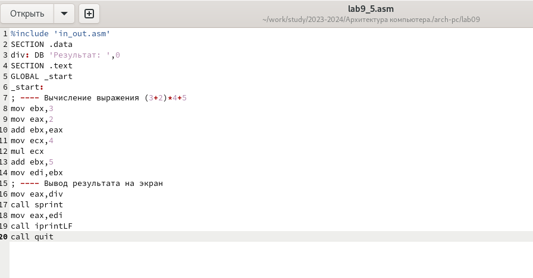
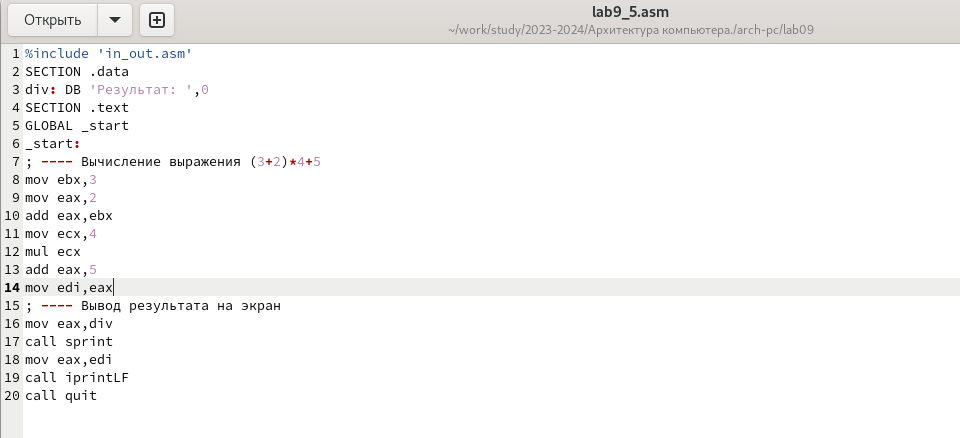

---
## Front matter
title: "Отчёт по лабораторной работе №9"
subtitle: "Дисциплина: архитектура компьютера."
author: "Наговицын Арсений Владимирович"
## Generic otions
lang: ru-RU
toc-title: "Содержание"

## Bibliography
bibliography: bib/cite.bib
csl: pandoc/csl/gost-r-7-0-5-2008-numeric.csl

## Pdf output format
toc: true # Table of contents
toc-depth: 2
lof: true # List of figures
lot: true # List of tables
fontsize: 12pt
linestretch: 1.5
papersize: a4
documentclass: scrreprt
## I18n polyglossia
polyglossia-lang:
  name: russian
  options:
	- spelling=modern
	- babelshorthands=true
polyglossia-otherlangs:
  name: english
## I18n babel
babel-lang: russian
babel-otherlangs: english
## Fonts
mainfont: PT Serif
romanfont: PT Serif
sansfont: PT Sans
monofont: PT Mono
mainfontoptions: Ligatures=TeX
romanfontoptions: Ligatures=TeX
sansfontoptions: Ligatures=TeX,Scale=MatchLowercase
monofontoptions: Scale=MatchLowercase,Scale=0.9
## Biblatex
biblatex: true
biblio-style: "gost-numeric"
biblatexoptions:
  - parentracker=true
  - backend=biber
  - hyperref=auto
  - language=auto
  - autolang=other*
  - citestyle=gost-numeric
## Pandoc-crossref LaTeX customization
figureTitle: "Рис."
tableTitle: "Таблица"
listingTitle: "Листинг"
lofTitle: "Список иллюстраций"
lotTitle: "Список таблиц"
lolTitle: "Листинги"
## Misc options
indent: true
header-includes:
  - \usepackage{indentfirst}
  - \usepackage{float} # keep figures where there are in the text
  - \floatplacement{figure}{H} # keep figures where there are in the text
---

# Цель работы

Приобретение навыков написания программ с использованием подпрограмм.
Знакомство с методами отладки при помощи GDB и его основными возможностями.

# Задание

1. Реализация подпрограмм в NASM.

2. Отладка программам с помощью GDB.

3. Добавление точек останова.

4. Работа с данными программы в GDB.

5. Обработка аргументов командной строки в GDB.

6. Выполнение заданий для самостоятельной работы.


# Выполнение лабораторной работы
## Реализация подпрограмм в NASM.

Создаю каталог для программ и перехожу в него. Создаю файл (рис. @fig:001).

{#fig:001 width=70%}

Ввожу в файл текст программы из листинга 9.1(рис. @fig:002).

{#fig:002 width=70%}

Создаю исполняемый файл и запускаю его (рис. @fig:003).

{#fig:003 width=70%}

Изменяю текст программы, добавив подпрограмму _subcalcul в подпрограмму _calcul (рис. @fig:004).

{#fig:004 width=70%}

**Изменённая программа**
```
%include 'in_out.asm'
SECTION .data
msg: DB 'Введите x: ',0
result: DB '2x+7=',0
SECTION .bss
x: RESB 80
res: RESB 80
SECTION .text
GLOBAL _start
_start:
;------------------------------------------
; Основная программа
;------------------------------------------
mov eax, msg
call sprint
mov ecx, x
mov edx, 80
call sread
mov eax,x
call atoi
call _subcalcul
call _calcul ; Вызов подпрограммы _calcul
mov eax,result
call sprint
mov eax,[res]
call iprintLF
call quit
;------------------------------------------
; Подпрограмма вычисления
; выражения "2x+7"
_subcalcul:
mov ebx,3
mul ebx
add eax,-1
ret
_calcul:
mov ebx,2
mul ebx
add eax,7
mov [res],eax
ret ; выход из подпрограммы
```
Создаю исполняемый файл и запускаю его (рис. @fig:005).

{#fig:005 width=70%}

## Отладка программам с помощью GDB.

Создаю файл lab09-2.asm (рис. @fig:006).

{#fig:006 width=70%}

Ввожу в файл текст программы из листинга 9.1(рис. @fig:007).

{#fig:007 width=70%}

Создаю исполняемый файл и загружаю его в откладчик (рис. @fig:008).

{#fig:008 width=70%}

Проверяю работу программы, запустив ее в оболочке GDB с помощью команды run (рис. @fig:009).

{#fig:009 width=70%}

Ставлю точку останова на метку _start и запустил её. (рис. @fig:010).

{#fig:010 width=70%}

Просматриваю дисассимилированный код (рис. @fig:011).

{#fig:011 width=70%}

Просматриваю дисассимилированный код с Intel’овским синтаксисом (рис. @fig:012).

{#fig:012 width=70%}

Включая режим графики (рис. @fig:013).

{#fig:013 width=70%}

## Добавление точек останова

Проверяю установленные точки останова, добавляю еще одну точку останова((рис. @fig:014).

{#fig:014 width=70%}

## Работа с данными программы в GDB.

Выполнил 5 инструкций с помощью команды stepi (рис. @fig:015).

{#fig:015 width=70%}

Изменились значения регистров eax, ecx, edx и ebx.

Посматриваю значение переменной msg1 по имени и msg2 по адресу (рис. @fig:016).

{#fig:016 width=70%}

Изменяю первый символ переменных msg1 и msg2 (рис. @fig:017).

{#fig:017 width=70%}

Вывожу в различных форматах значение регистра edx (рис. @fig:018).

{#fig:018 width=70%}

Завершаю выполнение программы с помощью команды continue и вquit (рис. @fig:019).

{#fig:019 width=70%}

## Обработка аргументов командной строки в GDB.

Скопировав файл и переименовав его. Создаю исполняемый файл (рис. @fig:020).

{#fig:020 width=70%}

Устанавливаю точку останова и запускаю файл (рис. @fig:021).

{#fig:021 width=70%}

Просматриваю вершину стека по их адресам (рис. @fig:022).

{#fig:022 width=70%}

Шаг изменения адреса равен 4, так как количество аргументов командной строки равно 4.

## Выполнение заданий для самостоятельной работы.

1. Создаю файл (рис. @fig:023).

{#fig:023 width=70%}

Ввожу в файл текст программы из листинга 9.4(рис. @fig:024).

{#fig:024 width=70%}
**Листинг 9.4:**
```
%include 'in_out.asm' 
SECTION .data 
msg db "Функция: f(x) = 15*x - 9",0 
msg1 db "Результат: ",0 
SECTION .text 
global _start 
_start: 
pop ecx       
pop edx   
sub ecx,1 
mov esi, 0 
next: 
cmp ecx,0h 
jz _end 
pop eax 
call atoi 
call _calcul 
loop next 
_end: 
mov eax, msg 
call sprintLF 
mov eax, msg1 
call sprint 
mov eax, esi 
call iprintLF 
call quit 
 
_calcul: 
mov ebx, 15 
mul ebx ; 
add eax, -9 ; 
add esi, eax
ret
```
Создаю исполняемый файл и запускаю его (рис. @fig:025).

{#fig:025 width=70%}

2. Создаю файл lab9_5.asm (рис. @fig:026).

{#fig:026 width=70%}

Ввожу в файл текст программы из листинга 9.3(рис. @fig:027).

{#fig:027 width=70%}

Создаю исполняемый файл (рис. @fig:028).

{#fig:028 width=70%}

Загружаю и запускаю файл программы в оболочке GDB (рис. @fig:029).

{#fig:029 width=70%}

Ставлю точку Останова на метку _start (рис. @fig:030).

{#fig:030 width=70%}

Включаю режим графики (рис. @fig:031).

{#fig:031 width=70%}

Ввожу команду stepi 5 раз, замечаю что умножается не тот регистр (рис. @fig:032).

{#fig:032 width=70%}

Изменяю текст программы. (рис. @fig:033).

{#fig:033 width=70%}

**Листинг 9.5:**
```
%include 'in_out.asm'
SECTION .data
div: DB 'Результат: ',0
SECTION .text
GLOBAL _start
_start:
; ---- Вычисление выражения (3+2)*4+5
mov ebx,3
mov eax,2
add eax,ebx
mov ecx,4
mul ecx
add eax,5
mov edi,eax
; ---- Вывод результата на экран
mov eax,div
call sprint
mov eax,edi
call iprintLF
call quit
```

Создаю исполняемый файл и запускаю его (рис. @fig:034).

{#fig:034 width=70%}
# Выводы

В этой лабораторной работе были приобретены навыки написания программ с использованием подпрограмм, а также были рассмотрены методы отладки при помощи GDB и его основные возможности.

