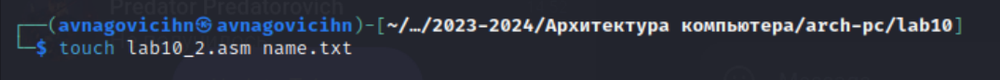
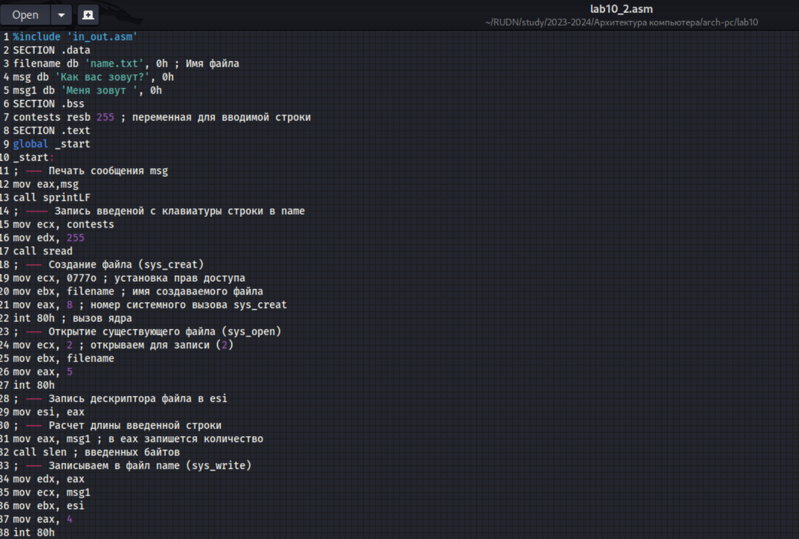

---
## Front matter
title: "Отчёт по лабораторной работе №10"
subtitle: "Дисциплина: архитектура компьютера."
author: "Наговицын Арсений Владимирович"

## Generic otions
lang: ru-RU
toc-title: "Содержание"

## Bibliography
bibliography: bib/cite.bib
csl: pandoc/csl/gost-r-7-0-5-2008-numeric.csl

## Pdf output format
toc: true # Table of contents
toc-depth: 2
lof: true # List of figures
lot: true # List of tables
fontsize: 12pt
linestretch: 1.5
papersize: a4
documentclass: scrreprt
## I18n polyglossia
polyglossia-lang:
  name: russian
  options:
	- spelling=modern
	- babelshorthands=true
polyglossia-otherlangs:
  name: english
## I18n babel
babel-lang: russian
babel-otherlangs: english
## Fonts
mainfont: PT Serif
romanfont: PT Serif
sansfont: PT Sans
monofont: PT Mono
mainfontoptions: Ligatures=TeX
romanfontoptions: Ligatures=TeX
sansfontoptions: Ligatures=TeX,Scale=MatchLowercase
monofontoptions: Scale=MatchLowercase,Scale=0.9
## Biblatex
biblatex: true
biblio-style: "gost-numeric"
biblatexoptions:
  - parentracker=true
  - backend=biber
  - hyperref=auto
  - language=auto
  - autolang=other*
  - citestyle=gost-numeric
## Pandoc-crossref LaTeX customization
figureTitle: "Рис."
tableTitle: "Таблица"
listingTitle: "Листинг"
lofTitle: "Список иллюстраций"
lotTitle: "Список таблиц"
lolTitle: "Листинги"
## Misc options
indent: true
header-includes:
  - \usepackage{indentfirst}
  - \usepackage{float} # keep figures where there are in the text
  - \floatplacement{figure}{H} # keep figures where there are in the text
---

# Цель работы

Целью данной лабораторной работы является приобретение навыков написания программ для работы с файлами.

# Задание

1. Выполнение лабораторной работы.

2. Выполнение заданий для самостоятельной работы.

# Выполнение лабораторной работы

1. Создаю каталог для программ и перехожу в него. Создаю файл (рис. @fig:001).

{#fig:001 width=70%}

Ввожу в файл текст программы из листинга 10.1(рис. @fig:002).

{#fig:002 width=70%}

2. Создаю исполняемый файл, запускаю его и проверяю правильность выполнения (рис. @fig:003).

{#fig:003 width=70%}

3. С помощью команды chmod запрещаю выполнение файла владельцу и запускаю файл (рис. @fig:004).

{#fig:004 width=70%}

Происходит отказ в доступе, так как выполнение файла было запрещено

4. Изменяю права доступа к файлу, добавив права на исполнение и запускаю файл (рис. @fig:005).

{#fig:005 width=70%}

Происходит отказ в доступе, так как исходный файл заблокирован для исполнения.

5. В соответствии с 12 вариантом предоставляю права доступа к файлам (рис. @fig:006).

{#fig:006 width=70%}

## Выполнение заданий для самостоятельной работы.

Cоздаю файлы (рис. @fig:007).

{#fig:007 width=70%}

Ввожу в файл текст программы из листинга 10.2(рис. @fig:002).

{#fig:008 width=70%}

**Листинг 10.2:**
```NASM
%include 'in_out.asm'
SECTION .data
filename db 'name.txt', 0h ; Имя файла
msg db 'Как вас зовут?', 0h
msg1 db 'Меня зовут ', 0h
SECTION .bss
contests resb 255 ; переменная для вводимой строки
SECTION .text
global _start
_start:
; --- Печать сообщения msg
mov eax,msg
call sprintLF
; ---- Запись введеной с клавиатуры строки в name
mov ecx, contests
mov edx, 255
call sread
; --- Создание файла (sys_creat)
mov ecx, 0777o ; установка прав доступа
mov ebx, filename ; имя создаваемого файла
mov eax, 8 ; номер системного вызова sys_creat
int 80h ; вызов ядра
; --- Открытие существующего файла (sys_open)
mov ecx, 2 ; открываем для записи (2)
mov ebx, filename
mov eax, 5
int 80h
; --- Запись дескриптора файла в esi
mov esi, eax
; --- Расчет длины введенной строки
mov eax, msg1 ; в eax запишется количество
call slen ; введенных байтов
; --- Записываем в файл name (sys_write)
mov edx, eax
mov ecx, msg1
mov ebx, esi
mov eax, 4
int 80h
; --- Расчет длины введенной строки
mov eax, contests ; в eax запишется количество
call slen ; введенных байтов
; --- Записываем в файл name (sys_write)
mov edx, eax
mov ecx, contests
mov ebx, esi
mov eax, 4
int 80h
; --- Закрываем файл (sys_close)
mov ebx, esi
mov eax, 6
int 80h
call quit
```

Создаю исполняемый файл, запускаю его и проверяю правильность выполнения (рис. @fig:009).

{#fig:009 width=70%}

# Выводы

В ходе выполнения данной лабораторной работы я приобрёл навыки написания
программ для работы с файлами.

